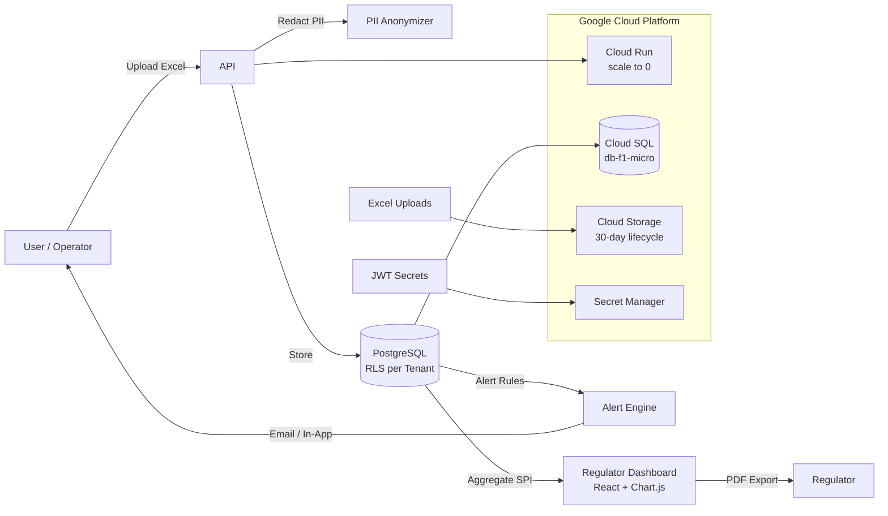

# Safety Monitor — ICAO Annex 19 Compliance System

[](https://github.com/your-org/safety-monitor/actions)
[](test-safety.js)
[](LICENSE)
[](https://cloud.google.com/run)

Multi-tenant safety monitoring and reporting system compliant with **ICAO Annex 19** (Safety Management), **Doc 9859** (Safety Management Manual), and **Doc 10959** (Safety Intelligence Manual). Processes Mandatory Occurrence Reports (MOR), Voluntary Safety Reports (VSR), and Hazard reports with real-time alerts, PII anonymization, and cross-tenant regulator oversight.

---

## Table of Contents

- [Overview](#overview)
- [Features](#features)
- [Architecture](#architecture)
- [Tech Stack](#tech-stack)
- [Quick Start](#quick-start)
- [API Reference](#api-reference)
- [Database](#database)
- [Testing](#testing)
- [Deployment](#deployment)
- [Project Structure](#project-structure)
- [License](#license)

---

## Overview

Safety Monitor provides an end-to-end safety data management pipeline for aviation operators:

1. **Import**: Excel spreadsheets (MOR/VSR/Hazard) uploaded via HTTP
2. **Anonymize**: PII automatically redacted and encrypted (AES-256-GCM) before storage
3. **Analyze**: Severity × Probability risk matrix triggers rule-based alerts
4. **Monitor**: Per-tenant dashboards for operators, cross-tenant aggregates for regulators
5. **Report**: ICAO Annex 19 aggregated SPI reports with PDF export

### ICAO Compliance

| Standard | Implementation |
|----------|---------------|
| **Annex 19** §5.1 | Safety data collection and processing (MOR/VSR/Hazard) |
| **Annex 19** §5.2 | Risk assessment via Severity × Probability matrix |
| **Annex 19** §6.1 | SPI aggregation and trending |
| **Doc 9859** Ch.5 | PII protection with encryption at rest |
| **Doc 10959** | Safety data analysis, processing and safety intelligence development |

### Multi-Tenancy

Each tenant (airline, MRO, ANSP) operates in an isolated data silo enforced by **PostgreSQL Row Level Security** (RLS). A JWT-embedded `tenant_id` sets the session context, and all policies filter automatically — no `WHERE tenant_id = ?` in application code.

---

## Features

### Excel Import Engine
- **Auto-detect** report type from filename (MOR, VSR, Hazard)
- **Configurable column mapping** per report type
- **Validation**: severity (1-5), probability (1-5)
- **Date normalization**: serial numbers → ISO dates

### PII Anonymization & Encryption
- **Redaction**: names, flight numbers (AA1234), tail numbers (N54321) replaced with `[REDACTED]`
- **Date offset**: occurrence dates stored as Monday-of-the-week to reduce identifiability
- **Encryption**: original data encrypted with AES-256-GCM and stored in separate `pii_store` table
- **Access control**: RLS restricts PII access to `admin` and `pii_viewer` roles only

### Alert Engine
- **Rule-based**: configurable severity × probability thresholds per alert level
- **Multi-channel**: in-app notifications, email (SMTP/Nodemailer)
- **Automatic evaluation**: alerts triggered on signal creation/import

### Regulator Dashboard
- **Cross-tenant aggregates**: SPI summary, trends, per-tenant comparison
- **Annex 19 PDF export**: landscape A4 with summary, charts, tenant data
- **Zero raw data exposure**: regulators see aggregates only — no individual signals
- **JWT-authenticated**: dedicated `regulator` role

### Just Culture Metrics
- **Reporting rate**: actual voluntary reports vs. expected (configurable per tenant)
- **Health score**: (Reporting Rate × 0.6) + (Trend × 0.2) + (Diversity × 0.2)
- **Trend analysis**: 6-month rolling comparison
- **Automated recommendations**: actionable suggestions based on score thresholds

### Cost Optimization (GCP)
- **Cloud Run**: scale to zero (no traffic = no cost)
- **Cloud SQL**: f1-micro ($8-10/mo), auto-resize disabled
- **Storage**: 30-day lifecycle on uploaded Excel files
- **Budget alert**: $15/month with 4 notification thresholds

---

## Architecture



### Data Flow

1. User uploads MOR/VSR/Hazard Excel → `POST /api/import/excel`
2. `excelParser` extracts signals with column mapping
3. `piiAnonymizer` redacts sensitive data + encrypts originals → `pii_store`
4. Redacted signal stored in `safety_signals` (RLS-enforced)
5. `alertEngine` evaluates signal against tenant's rules → `alerts` table
6. Regulator queries aggregate endpoints → SECURITY DEFINER functions bypass RLS
7. Dashboard renders cross-tenant SPI data with Chart.js

---

## Tech Stack

| Layer | Technology | Purpose |
|-------|-----------|---------|
| **Runtime** | Node.js 20 | JavaScript runtime |
| **Framework** | Express 4 | HTTP API server |
| **Database** | PostgreSQL 15 | Primary data store with RLS |
| **Auth** | JSON Web Tokens | Tenant + role-based auth |
| **Spreadsheet** | xlsx (SheetJS) | Excel parsing |
| **Encryption** | Node crypto (AES-256-GCM) | PII protection |
| **Logging** | Winston | Structured logging |
| **Email** | Nodemailer | Alert notifications |
| **Queue** | Bull (Redis) | Background job processing |
| **Frontend** | React 18 + Babel standalone | Regulator dashboard |
| **Charts** | Chart.js 4 | SPI visualizations |
| **PDF** | jsPDF + html2canvas | Annex 19 export |
| **IAC** | Terraform 1.5+ | GCP infrastructure |
| **CI/CD** | GitHub Actions | Build, test, deploy |
| **Container** | Docker (Alpine) | Production image |
| **Hosting** | Cloud Run (scale to zero) | Serverless compute |

---

## Quick Start

### Prerequisites

- Node.js 20+
- PostgreSQL 15+
- Redis (for Bull queues)

### 1. Clone and install

```bash
git clone https://github.com/your-org/safety-monitor.git
cd safety-monitor
npm install
```

### 2. Configure environment

```bash
cp .env.example .env
```

Required variables:

| Variable | Description | Example |
|----------|-------------|---------|
| `DB_NAME` | PostgreSQL database | `safety_monitor_dev` |
| `DB_USER` | Database user | `safety_user` |
| `DB_PASSWORD` | Database password | |
| `JWT_SECRET` | Token signing key (64+ chars) | |
| `ENCRYPTION_KEY` | AES-256 key (64 hex chars) | |
| `PORT` | Server port (default: 3000) | |
| `SMTP_HOST` | Email server | `smtp.example.com` |

### 3. Create database and run migrations

```bash
createdb safety_monitor_dev
npm run migrate
```

### 4. Start development server

```bash
npm run dev
```

### 5. Verify

```bash
curl http://localhost:3000/health
# {"status":"ok","db":"connected"}
```

---

## API Reference

### Public Endpoints

| Method | Path | Auth | Description |
|--------|------|------|-------------|
| `GET` | `/health` | None | Health check (DB connectivity) |
| `GET` | `/public/...` | None | Static assets (dashboard) |

### Safety Signals (Bearer token: `admin` role)

| Method | Path | Description |
|--------|------|-------------|
| `POST` | `/api/signals` | Create a safety signal (auto-redacts PII) |
| `GET` | `/api/signals` | List tenant's signals |
| `POST` | `/api/import/excel` | Upload MOR/VSR/Hazard Excel file |
| `GET` | `/api/signals/:id` | Get single signal |

**POST /api/signals**

```json
{
  "report_type": "VSR",
  "severity": 3,
  "probability": 2,
  "report_id": "VSR-2025-001",
  "occurrence_date": "2025-03-15",
  "description_raw": "Pilot reported turbulence on flight AA1234",
  "reporter_role": "pilot"
}
```

- `report_type`: `MOR`, `VSR`, or `Hazard`
- `severity`: 1–5
- `probability`: 1–5
- `reporter_role`: `pilot`, `cabin`, `maintenance`, `atc`, `ground`, `flight_ops`, `other`
- VSR reports automatically set `is_voluntary = true`

**POST /api/import/excel**

Upload an Excel file with `multipart/form-data` (field name: `file`). Filename must contain `MOR`, `VSR`, or `Hazard` for auto-detection.

### Alert Rules (Bearer token: `admin` role)

| Method | Path | Description |
|--------|------|-------------|
| `POST` | `/api/alerts/rules` | Create alert rule |
| `GET` | `/api/alerts/active` | List unacknowledged alerts |
| `POST` | `/api/alerts/:id/acknowledge` | Acknowledge alert |

### Regulator Endpoints (Bearer token: `regulator` role)

| Method | Path | Description |
|--------|------|-------------|
| `GET` | `/api/regulator/spis` | SPI summary (aggregated) |
| `GET` | `/api/regulator/trends` | Monthly trends (12 months) |
| `GET` | `/api/regulator/tenants` | Per-tenant aggregated data |
| `GET` | `/api/regulator/export` | Full Annex 19 export data |

### Just Culture Endpoints (Bearer token: `regulator` role)

| Method | Path | Description |
|--------|------|-------------|
| `GET` | `/api/just-culture/health` | Reporting rate, health score, trend, recommendations |
| `GET` | `/api/just-culture/timeline` | Monthly voluntary reports by tenant |
| `GET` | `/api/just-culture/benchmark` | Industry average comparison |

**GET /api/just-culture/health**

```json
{
  "reporting_rate": 72.5,
  "target_rate": 80,
  "health_score": 78,
  "trend": "+18%",
  "actual_voluntary": 145,
  "expected_voluntary": 200,
  "trend_score": 18,
  "diversity_score": 65,
  "recommendations": [
    "Increase voluntary reporting incentives",
    "Encourage reporting from underrepresented roles"
  ]
}
```

---

## Database

### Schema

| Table | Purpose | RLS |
|-------|---------|-----|
| `users` | Tenant users | `tenant_id = current_tenant_id()` |
| `safety_signals` | Safety reports | `tenant_id = current_tenant_id()` |
| `pii_store` | Encrypted PII (AES-256-GCM) | Restricted to `admin`/`pii_viewer` |
| `alerts` | Triggered alerts | `tenant_id = current_tenant_id()` |
| `alert_rules` | Alert rule configuration | `tenant_id = current_tenant_id()` |
| `excel_imports` | Import audit log | `tenant_id = current_tenant_id()` |
| `tenant_config` | Per-tenant configuration (Just Culture) | None (app-enforced) |
| `documents` | Tenant documents | `tenant_id = current_tenant_id()` |

### Row Level Security

RLS is enforced via `current_tenant_id()` session variable:

```sql
CREATE POLICY tenant_isolation ON safety_signals
  USING (tenant_id = current_tenant_id());
```

The `set_tenant_context()` function is called at the start of each authenticated request. All `INSERT`/`SELECT`/`UPDATE`/`DELETE` operations are transparently scoped.

### Regulator Bypass

Regulator aggregate queries use `SECURITY DEFINER` functions (e.g., `regulator_spi_summary()`, `just_culture_health()`) that bypass RLS and return aggregated JSONB — never raw signal data.

### Migrations

```bash
npm run migrate
```

Idempotent SQL migrations in `src/db/migrations/`:

| # | File | Purpose |
|---|------|---------|
| 001 | `rls.sql` | RLS infrastructure, users, documents |
| 002 | `safety_tables.sql` | Safety signals, alerts, rules, imports |
| 003 | `pii_store.sql` | Encrypted PII storage with RLS |
| 004 | `regulator_functions.sql` | SECURITY DEFINER aggregation functions |
| 005 | `just_culture.sql` | Just Culture columns, tenant_config, analytics |

---

## Testing

### Integration Tests

```bash
npm test
```

20 integration tests covering:

- Health check and database connectivity
- Alert rule CRUD
- PII redaction in descriptions (names, flight numbers, tail numbers)
- Date normalization to week Monday
- Alert engine triggering (severity × probability matrix)
- Email notification mocking (Nodemailer)
- Excel import with PII redaction
- Encrypted PII storage verification
- **Just Culture metrics** (VSR auto-voluntary, health endpoint, timeline, benchmark)

Tests run against a real PostgreSQL database (`DB_NAME=safety_monitor_dev`). The test server starts on a dynamic port to avoid port conflicts.

---

## Deployment

### GCP (Recommended)

One-command deployment to Google Cloud Platform:

```bash
export GCP_PROJECT_ID=your-project
export DB_PASSWORD=...
export JWT_SECRET=...
export ENCRYPTION_KEY=...
./scripts/deploy.sh
```

This runs Terraform, builds/pushes the Docker image, runs migrations, deploys to Cloud Run, and smoke-tests the health endpoint.

See [DEPLOYMENT.md](DEPLOYMENT.md) for detailed instructions.

### Cost Breakdown

| Resource | Monthly Cost |
|----------|-------------|
| Cloud Run (scale to zero) | $0–2 |
| Cloud SQL (db-f1-micro) | $8–10 |
| Storage + Secrets + Networking | ~$3–5 |
| **Total** | **~$12–18/month** |

See [COST_ESTIMATION.md](COST_ESTIMATION.md) for details.

### Docker

```bash
# Build
docker build -t safety-monitor .

# Run with Cloud SQL proxy
docker compose up
```

---

## Project Structure

```
├── server.js                          # Entry point
├── Dockerfile                         # Multi-stage (Alpine production)
├── docker-compose.yml                 # Local Cloud SQL proxy
├── package.json
├── .env.example
├── .github/workflows/deploy.yml       # CI/CD pipeline
│
├── src/
│   ├── api/routes/
│   │   ├── index.js                   # Route aggregator
│   │   ├── safety.js                  # Signals, alerts, Excel import
│   │   ├── regulator.js               # Regulator aggregate endpoints
│   │   └── justCulture.js             # Just Culture metrics
│   ├── middleware/
│   │   ├── auth.js                    # JWT verification + tenant context
│   │   └── regulatorAuth.js           # Regulator role check
│   ├── services/
│   │   ├── excelParser.js             # MOR/VSR/Hazard parsing
│   │   ├── alertEngine.js             # Rule-based alert evaluation
│   │   ├── piiAnonymizer.js           # PII redaction + AES-256-GCM
│   │   ├── email.js                   # Nodemailer transport
│   │   ├── logger.js                  # Winston logger
│   │   └── queue.js                   # Bull queue (Redis)
│   └── db/
│       ├── pool.js                    # PostgreSQL pool (custom DATE parser)
│       └── migrations/
│           ├── run.js                 # Migration runner
│           ├── 001_rls.sql
│           ├── 002_safety_tables.sql
│           ├── 003_pii_store.sql
│           ├── 004_regulator_functions.sql
│           └── 005_just_culture.sql
│
├── public/dashboard/regulator/
│   ├── index.html                     # React SPA (CDN-loaded)
│   └── styles.css                     # Dashboard styles
│
├── infra/
│   ├── main.tf                        # GCP infrastructure (Terraform)
│   ├── variables.tf
│   ├── outputs.tf
│   └── terraform.tfvars.example
│
├── scripts/
│   ├── deploy.sh                      # One-command deployment
│   ├── migrate.sh                     # Remote migration runner
│   └── smoke-test.sh                  # Deployment verification
│
├── test-safety.js                     # 20 integration tests
└── uploads/                           # Local file uploads (dev only)
```

---

## Security

| Measure | Implementation |
|---------|---------------|
| **PII Protection** | AES-256-GCM encryption, automatic redaction, date obfuscation |
| **Tenant Isolation** | PostgreSQL RLS enforced at database level |
| **Secrets Management** | GCP Secret Manager (no secrets in env vars) |
| **Transport** | HTTPS (Cloud Run), TLS for database connections |
| **Auth** | JWT with tenant_id + role claims |
| **Regulator Access** | Aggregated data only — no raw signal exposure |
| **Network** | Cloud SQL private IP (no public access) |

---

## License

MIT — See [LICENSE](LICENSE) for details.
