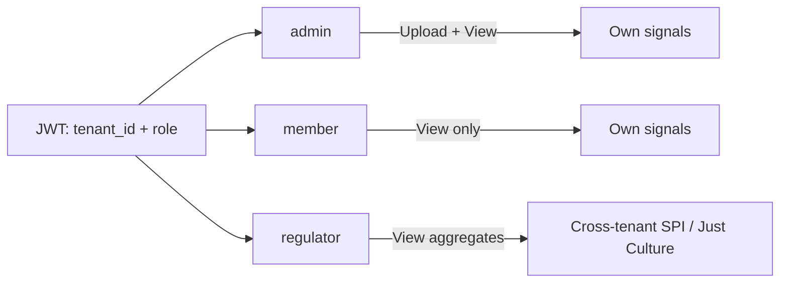
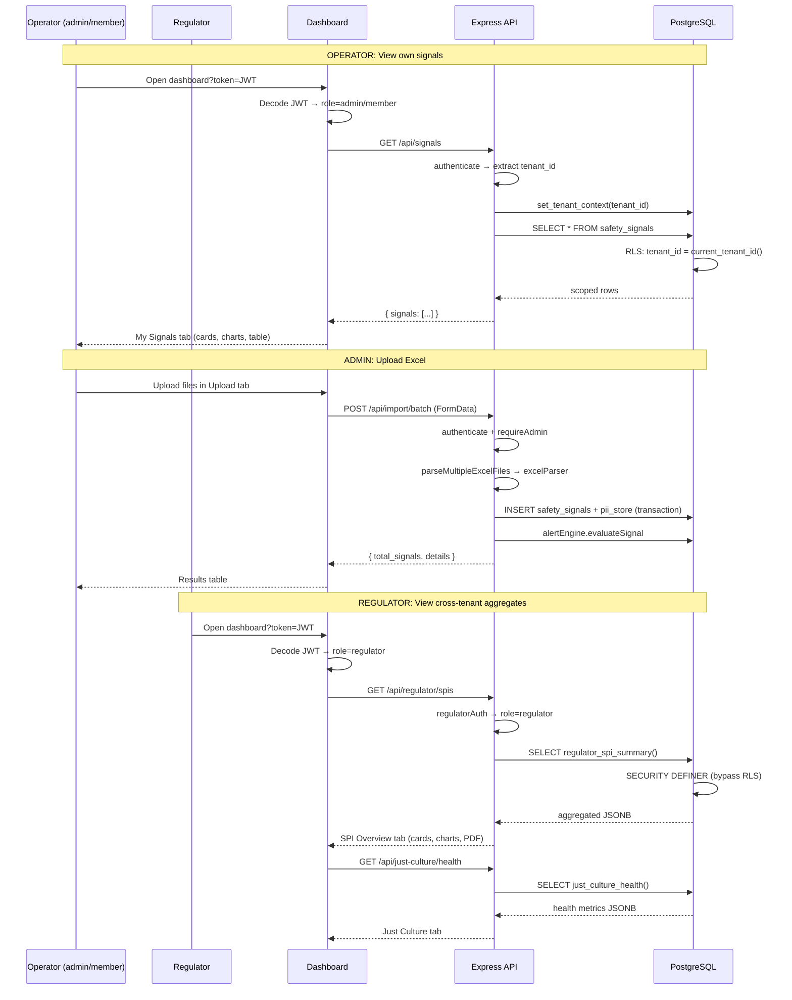
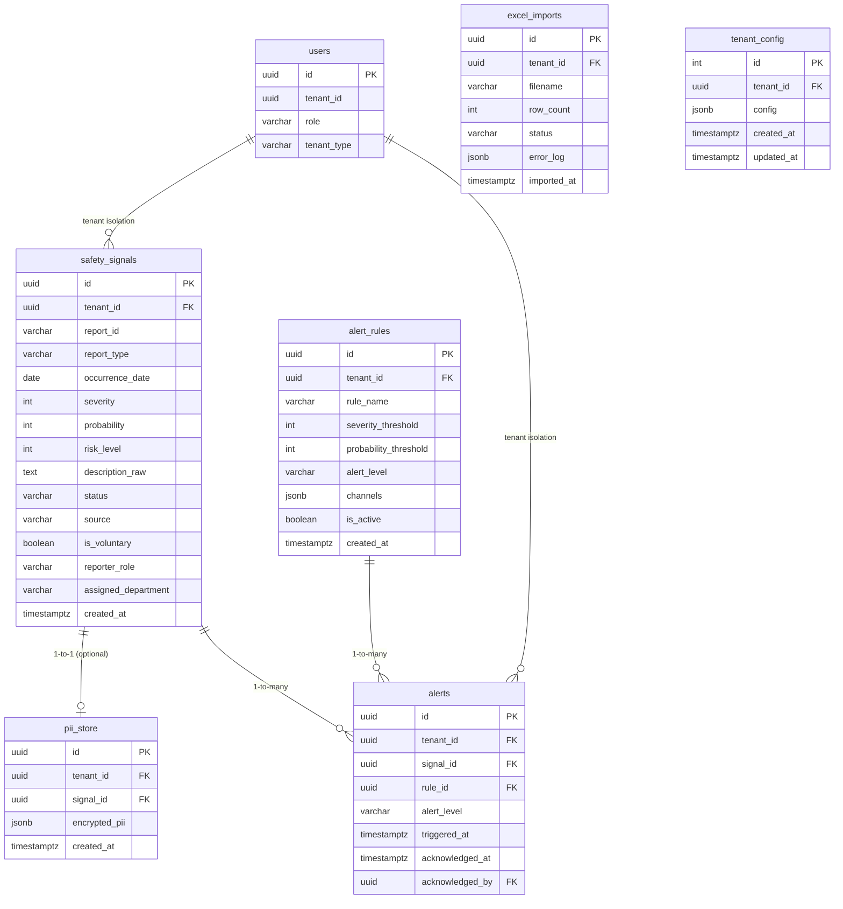
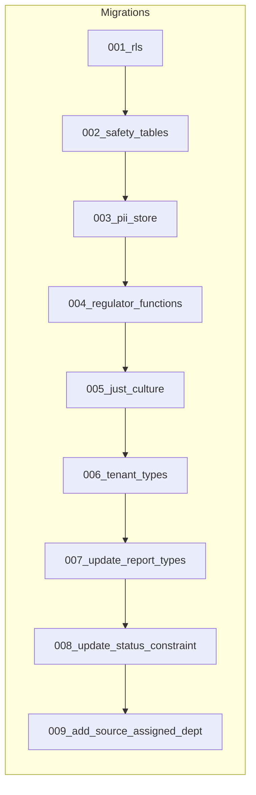

# Application Architecture & Action Flow

## Role-Based Access



| Role | Description | Can Upload | Can View |
|------|-------------|-----------|----------|
| `admin` | Safety department | ✅ Yes (own tenant) | Own signals + Upload tab |
| `member` | Operator staff | ❌ No | Own signals only |
| `regulator` | Regulatory authority | ❌ No | Cross-tenant aggregates |

---

## Upload & Processing Flow

```mermaid
flowchart TD
    subgraph Upload["Upload (Dashboard / API)"]
        ADMIN[Admin user<br/>JWT: admin role] --> BATCH[POST /api/import/batch]
        BATCH --> AUTH{authenticate + requireAdmin}
        AUTH -->|JWT valid, role=admin| PARSE[parseMultipleExcelFiles]
        AUTH -->|Rejected| ERR[403 Forbidden]
    end

    subgraph Parser["Excel Parser (excelParser.js)"]
        PARSE --> SHEET1[classifySheet name]
        SHEET1 -->|master| M1[processMasterSheet]
        SHEET1 -->|occurrence| M2[processOccurrenceSheet]
        SHEET1 -->|hazard| M3[processHazardSheet]
        SHEET1 -->|safety_defi| M4[processSafetyDeficiencySheet]
        SHEET1 -->|diversion| M5[processDiversionSheet]
        SHEET1 -->|risk_register| SKIP[Skipped - reference]

        M1 & M2 & M3 & M4 & M5 --> REDACT[redactPII inline]
        REDACT --> SIGNALS[signal objects]
    end

    subgraph PII["PII Anonymizer (piiAnonymizer.js)"]
        SIGNALS --> EXTRACT[extractAndRedact]
        EXTRACT --> REDACTED[redacted fields]
        EXTRACT --> ENCRYPTED[AES-256-GCM encrypted originals]
    end

    subgraph Storage["Database Insert (storeSignal)"]
        REDACTED & ENCRYPTED --> TX{BEGIN TRANSACTION}
        TX --> INS1[INSERT safety_signals<br/>tenant scope from JWT]
        TX --> INS2[INSERT pii_store<br/>encrypted PII]
        TX --> COMMIT[COMMIT]
        COMMIT --> RESULT[{ id, ...signalData }]
    end

    subgraph Alerts["Alert Engine (alertEngine.js)"]
        RESULT --> EVAL[evaluateSignal]
        EVAL --> RULES{Match alert_rules?}
        RULES -->|Yes| IN[INSERT alerts]
        RULES -->|No| DONE[Done]
        IN --> EMAIL[Optional: send email via Nodemailer]
    end
```

---

## Query Flows



---

## Database Schema



### Row Level Security

All data tables have RLS enforced:

```sql
CREATE POLICY tenant_isolation ON safety_signals
  USING (tenant_id = current_tenant_id());
```

### Regulator Bypass (SECURITY DEFINER)

| Function | Returns |
|----------|---------|
| `regulator_spi_summary()` | Total signals, avg risk, alerts, by-type breakdown |
| `regulator_trends(months)` | Monthly signal counts and avg risk |
| `regulator_tenants()` | Per-tenant signal count, avg risk, by-type |
| `just_culture_health()` | Reporting rate, health score, trend, recommendations |
| `just_culture_timeline(months)` | Monthly voluntary report counts |
| `just_culture_benchmark()` | Industry avg, best-in-class, ICAO benchmark |

---

## Migration Order



| # | File | Purpose |
|---|------|---------|
| 001 | `001_rls.sql` | RLS infrastructure, users, documents |
| 002 | `002_safety_tables.sql` | safety_signals, alert_rules, alerts, excel_imports |
| 003 | `003_pii_store.sql` | Encrypted PII storage with RLS |
| 004 | `004_regulator_functions.sql` | SECURITY DEFINER aggregation functions |
| 005 | `005_just_culture.sql` | Just Culture columns, tenant_config, analytics |
| 006 | `006_tenant_types.sql` | tenant_type column on users |
| 007 | `007_update_report_types.sql` | Extended report_type CHECK constraint |
| 008 | `008_update_status_constraint.sql` | 'Reported' added to status CHECK |
| 009 | `009_add_source_assigned_dept.sql` | source + assigned_department columns |
